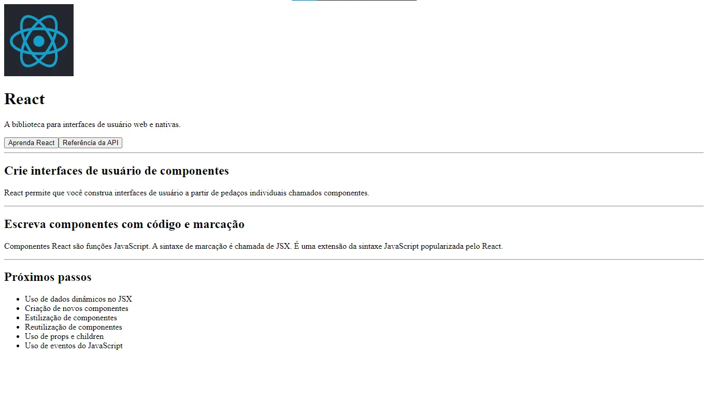

# Exercício 1

Crie um novo projeto React usando o Vite, remova todo o conteúdo inicial do projeto e então reproduza a página html abaixo usando JSX.

## Imagem utilizada no exercício:

Lembrando que você pode utilizá-la colocando-a na pasta "public" do Vite (usando o caminho "/nome-da-imagem.png")

## Página HTML a ser reproduzida:

## Tarefa

Reproduza a estrutura HTML acima usando React e JSX no seu componente `App.jsx`. Certifique-se de que a página renderizada no navegador se assemelhe à imagem de referência fornecida.
